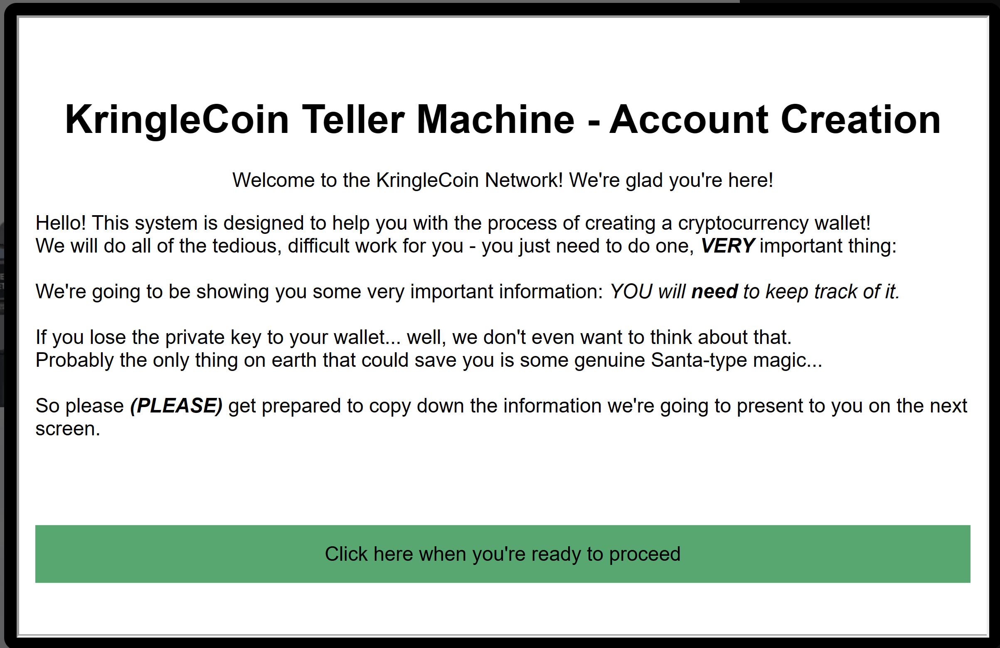
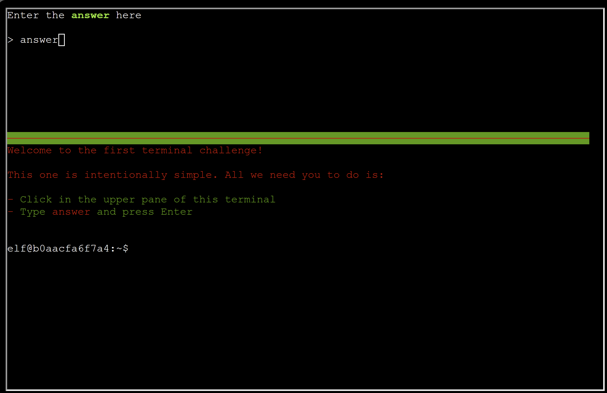
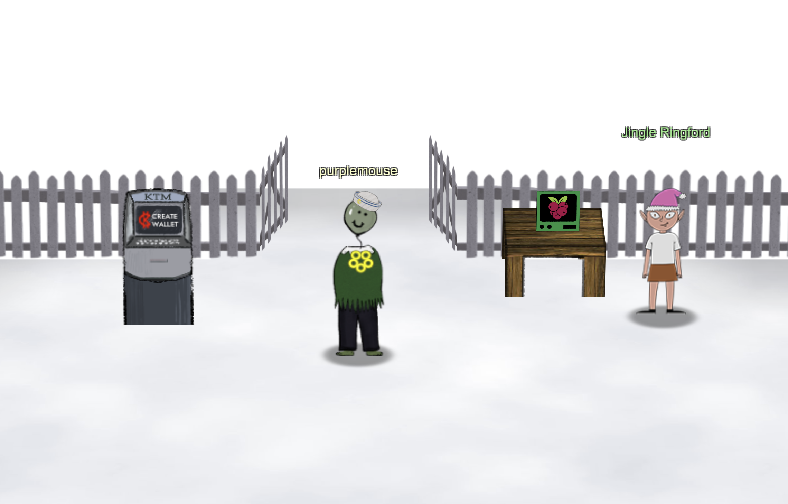

Get your bearings at KringleCon

## Checklist
✅ Talk to Jingle Ringford

Jingle Ringford will start you on your journey!

✅ Get your badge

Pick up your badge

✅ Create a wallet

Create a crypto wallet

✅ Use the terminal

Click the computer terminal

✅ Talk to Santa

Talk to Santa in front of the castle to get your next objectives.

## Solution
First, chat with Jingle Ringford. Jingle Ringford welcomes us to the 2022 SANS Holiday Hack Challenge and hands us our badge.

### Chat with Jingle Ringford
> Welcome to the North Pole, KringleCon, and the 2022 SANS Holiday Hack Challenge! I’m Jingle Ringford, one of Santa’s elves.
Santa asked me to come here and give you a short orientation to this festive event.

>Before you move forward through the gate, I’ll ask you to accomplish a few simple tasks.

>First things first, here's your badge! It's the five golden rings in the middle of your avatar.

>Great - now you're official!

>Click on the badge on your avatar. That’s where you will see your Objectives, Hints, and gathered Items for the Holiday Hack Challenge.

>We’ve also got handy links to the KringleCon talks and more there for you!

>Next, click on that machine to the left and create a crypto wallet for yourself. Don't lose that key!

## Create a cryto wallet.
Click on the KTM to the left and follow the instructions on screen.

> Fantastic!

>OK, one last thing. Click on the Cranberry Pi Terminal and follow the on-screen instructions.

### Terminal

> Great! Your orientation is now complete! You can enter through the gate now. Have FUN!!!

### Chat with Santa
>Welcome to the North Pole, intrepid traveler!
>
>Wow, we had quite a storm last night!
>
>My castle door is sealed shut behind a giant snowbank.
>
>The Elves have decided to burrow under the snow to get everything ready for our holiday deliveries.
>
>But there's another wrinkle: my Five Golden Rings have gone missing.
>
>Without the magic of the Rings, we simply can't launch the holiday season.
>
>My reindeer won't fly; I won't be able to zip up and down chimneys.
>
>What's worse, without the magic Rings, I can't fit the millions of cookies in my belly!
>
>I challenge you to go on a quest to find and retrieve each of the five Rings.
>
>I'll put some initial goals in your badge for you.
>
>The holidays, and the whole world, are counting on you.