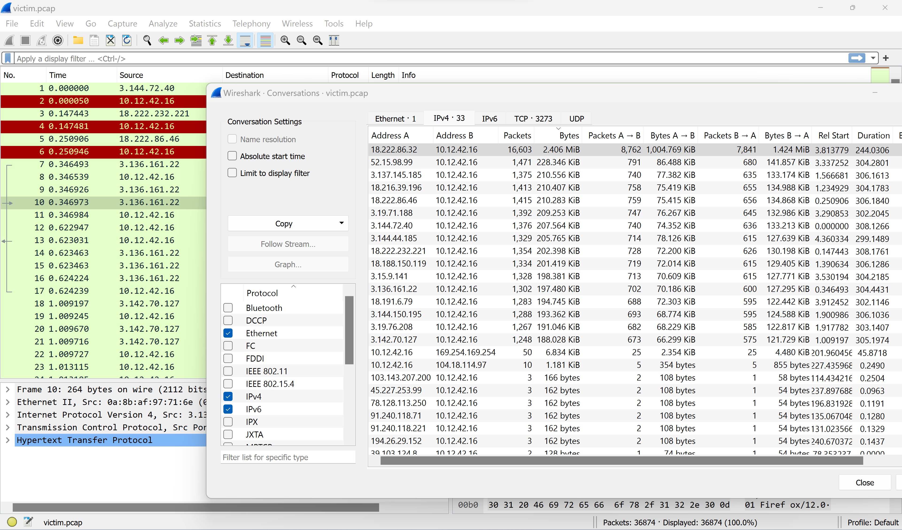

Use the artifacts from Alabaster Snowball to analyze this attack on the Boria mines. Most of the traffic to this site is nice, but one IP address is being naughty! Which is it? Visit Sparkle Redberry in the Web Ring for hints.

Difficulty: 1/5

## Chat with Alabaster Snowball

Hey there! I'm Alabaster Snowball

And I have to say, I'm a bit distressed.

I was working with the dwarves and their Boria mines, and I found some disturbing activity!

Looking through these artifacts, I think something naughty's going on.

Can you please take a look and answer a few questions for me?

First, we need to know where the attacker is coming from.

If you haven't looked at Wireshark's Statistics menu, this might be a good time!

## Terminal
Find the naughty IP address
wireshark stats menu
The victim web server is 10.12.42.16
next top talker

hint: [top talker](https://protocoholic.com/2018/05/24/wireshark-how-to-identify-top-talkers-in-network/)

From the hint:
>You need to go to statistics>conversations . Click on conversations and you will see following window popping up. Click on Ipv4 and then click on Bytes to sort the flow with number of bytes and you are done!!

`18.222.86.32`

## Rejoice
Aha, you found the naughty actor! Next, please look into the account brute force attack.

You can focus on requests to /login.html~