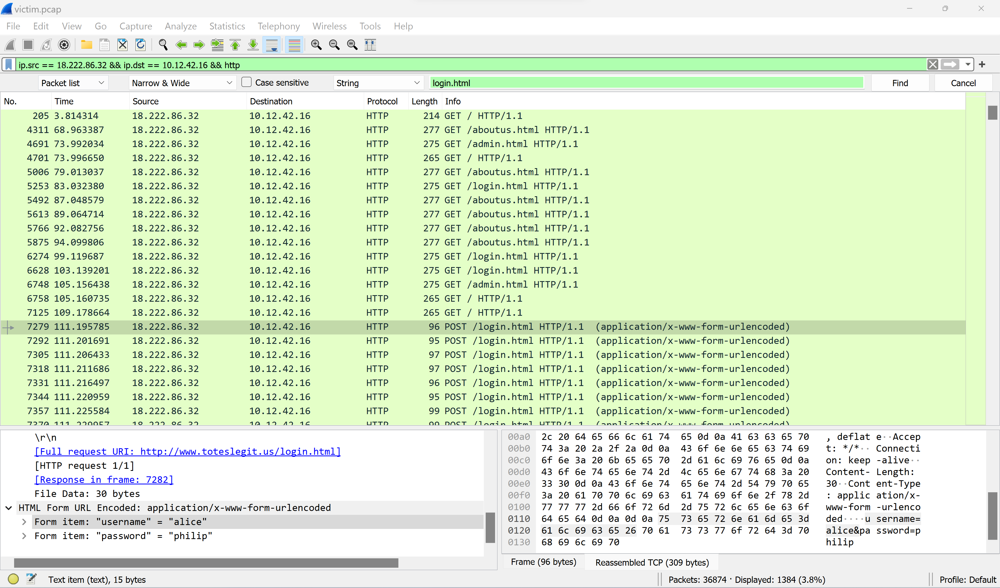

The first attack is a brute force login. What's the first username tried?

Difficulty: 1/5

## Chat with Alabaster Snowball
Aha, you found the naughty actor! Next, please look into the account brute force attack.

You can focus on requests to /login.html~

## Terminal
> What's the first username tried in the bruteforce attack?
>hint: [search for strings](https://www.wireshark.org/docs/wsug_html_chunked/ChWorkFindPacketSection.html) in packets

Use the following display filer:

`ip.src == 18.222.86.32 && ip.dst == 10.12.42.16 && http`

Also in the find packet toolbar search for "login.html".


Inspect the first packet details:
```
HTML Form URL Encoded: application/x-www-form-urlencoded
    Form item: "username" = "alice"
    Form item: "password" = "philip"

```
## Rejoice
Alice? I totally expected Eve! Well how about forced browsing? What's the first URL path they found that way?

The misses will have HTTP status code 404 and, in this case, the successful guesses return 200.
