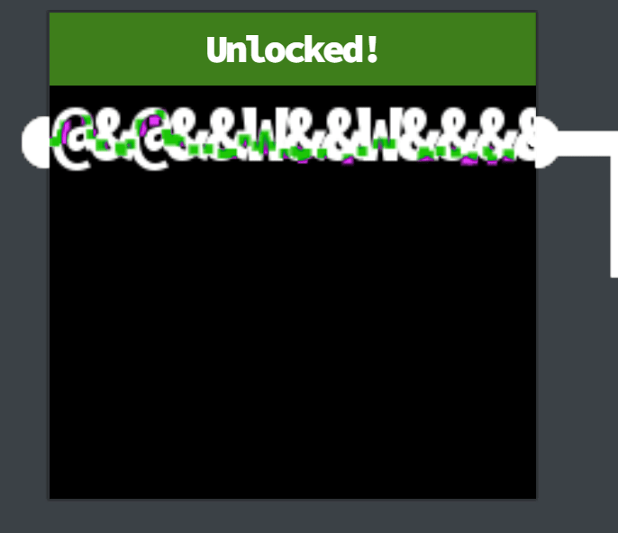

Open the door to the Boria Mines. Help Alabaster Snowball in the Web Ring to get some hints for this challenge.

Difficulty: 3/5

## Chat with Hal Tandybuck
Oh hi, I'm Hal Tandybuck. And who might you be?

I'm hanging out by the door to the mines here because, well, I haven't figured out the locks yet.

It actually reminds me of this locked crate I had three years ago...

I doubt we'll get much in the way of debug output.

Think you can help me get through?

## Terminal
First we read source code to figure out how the locks work so that we can open the door.

Each pin is coded as a form within an iframe. When we click the go button, that will submit the form by generating a post request to the server.

The idea is to connect the color sensors so that there is a continuous colour path from the input sensor to the output sensor.

```
<div class="iframes">
            <iframe src="/pin1" class="pin1 completed"></iframe>
            <iframe src="/pin2" class="pin2"></iframe>
            <iframe src="/pin3" class="pin3"></iframe>
            <iframe src="/pin6" class="pin6"></iframe>
            <iframe src="/pin5" class="pin5"></iframe>
            <iframe src="/pin4" class="pin4"></iframe>
        
            <canvas class="effects" width="744" height="422"></canvas>
            <button class="helpBtn">?</button>
        </div>
```
pin1:


Looking at the source code for pin 1 we see the answer within a comment.
```
<form method="post" action="pin1">
        <!-- @&@&&W&&W&&&& -->
        <input class="inputTxt" name="inputTxt" type="text" value="" autocomplete="off">
        <button>GO</button>
    </form>
```

`@&@&&W&&W&&&&`



pin2:


Looking at the comment in the form we get a clue that the input may not filter out HTML.

```
<form method="post" action="pin2">
        <!-- TODO: FILTER OUT HTML FROM USER INPUT -->
        <input class="inputTxt" name="inputTxt" type="text" value="" autocomplete="off">
        <button>GO</button>
    </form>
```

As both the input and output sensors are white let's attempt to fill the pin with white color.

`<style>body {background-color: white;}</style>`


pin3:


Looking at the comment in the form we get a clue that the input may not filter out javascript.
```
<form method="post" action="pin3">
        <!-- TODO: FILTER OUT JAVASCRIPT FROM USER INPUT -->
        <input class="inputTxt" name="inputTxt" type="text" value="" autocomplete="off">
        <button>GO</button>
    </form>
```

As both the input and output sensors are blue let's attempt to fill the pin with blue color using JS.

`<script>document.querySelector("body").style.cssText = "background-color:blue"</script>`


pin4:

```
<form method="post" action="pin4">
        <input class="inputTxt" name="inputTxt" type="text" value="" autocomplete="off" onblur="sanitizeInput()">
        <button>GO</button>
    </form>
```
```
const sanitizeInput = () => {
            const input = document.querySelector('.inputTxt');
            const content = input.value;
            input.value = content
                .replace(/"/, '')
                .replace(/'/, '')
                .replace(/</, '')
                .replace(/>/, '');
        }
```

As the sanitization happens on the client side, it can be easily disabled from the browser itself from the Event Listeners tab:


Remove blur event listener on input element and submit the following HTML. As HTML sanitization doesn't happen at the server end either, the code is executed as is.

```
<div style="height:100px;width:200px;background-color:white"></div>
<div style="height:100px;width:200px;background-color:blue"></div>
```


pin5:


Similar to pin4, remove the event listener on blur and submit the following JS. As JS sanitization doesn't happen at the server end either, the code is executed as is.
```
<script>
bod = document.querySelector("body");
bod.style.cssText = "background-color:red";
new_div = document.createElement("div");
new_div.style.cssText = "height: 120px;width: 200px;background-color:blue;margin-left: 20px;margin-top: 100px;";
bod.append(new_div);
</script>
```


pin6:

After a lot of fiddling around with the filter on this one I realised that some HTML and JS input validation was present but the img HTML element did not seem to be filtered. In particular image [data urls](https://developer.mozilla.org/en-US/docs/Web/HTTP/Basics_of_HTTP/Data_URLs) were allowed!
In fact, most of the pins did not filter the img element with data URL as source:


To solve pin6 we need green, red and blue colored images which I picked up from wikimedia commons.

> Red
```

```

> Blue
```


```


>Green
```

```

> Putting it all together
```


```


## Rejoice


Wha - what?? You opened all the locks?! Well then...

Did you see the nearby terminal with evidence of an XXE attack?

Maybe take a close look at that kind of thing.