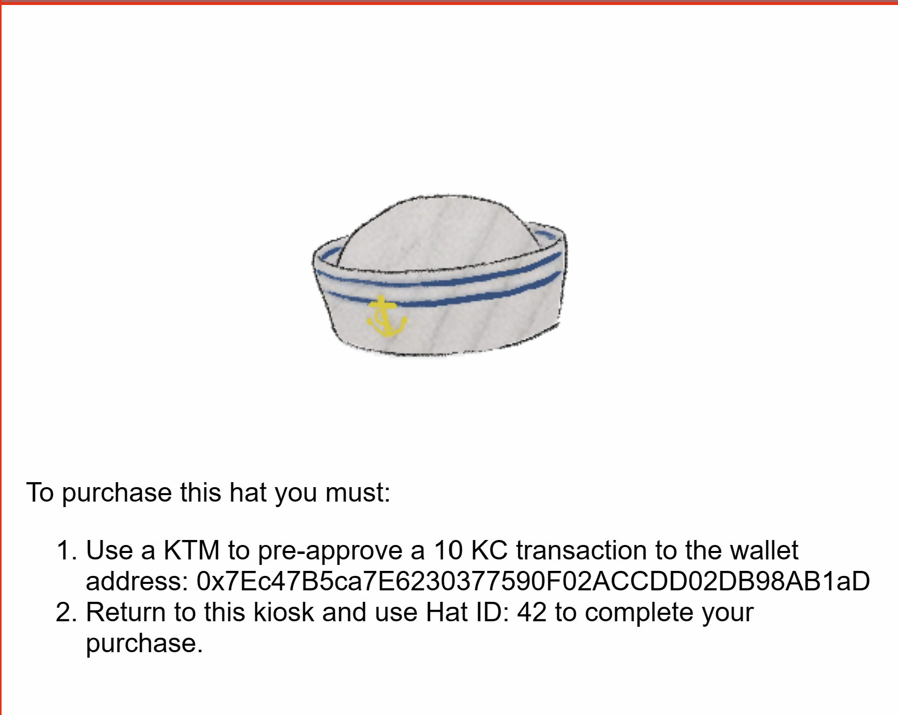
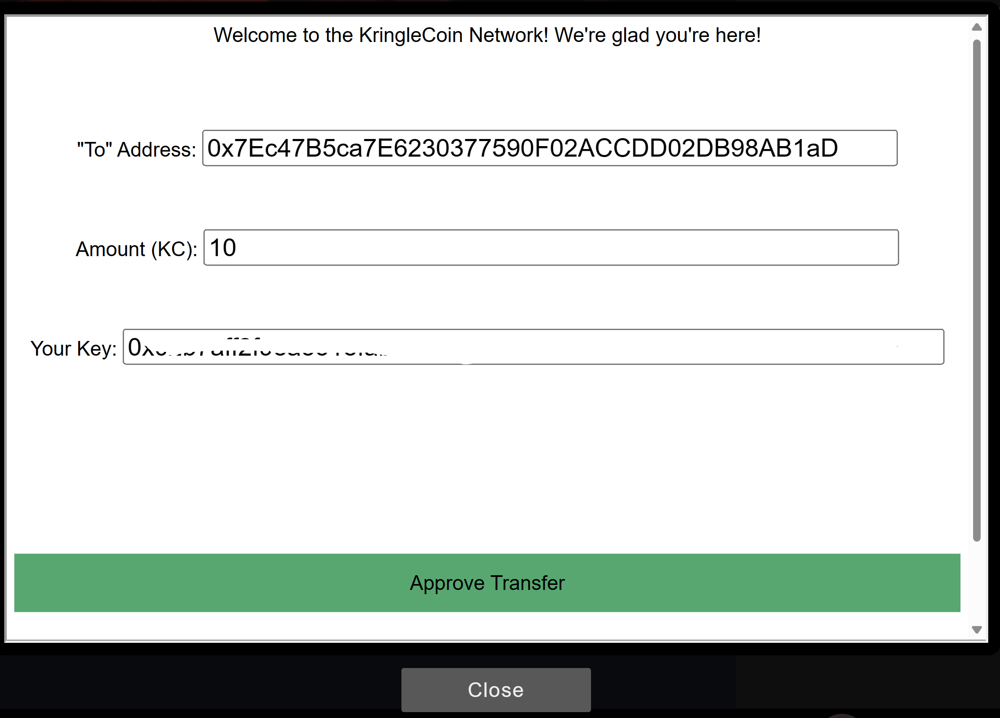
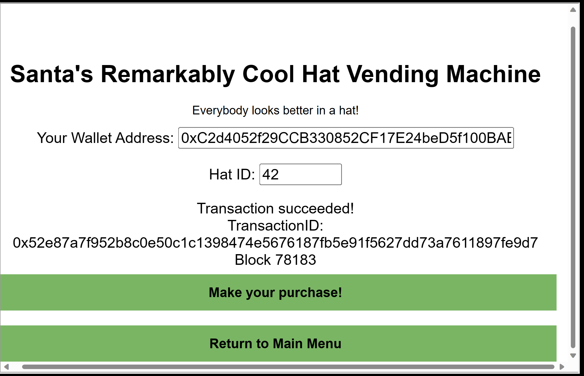

Travel to the Burning Ring of Fire and purchase a hat from the vending machine with KringleCoin. Find hints for this objective hidden throughout the tunnels.

Difficulty: 2/5

## Chat with Wombley Cube
Hey there! I'm Wombley Cube. It's so nice to see a friendly face.

What's an elf doing all the way down here with all these sporcs, you ask?

I'm selling snazzy, fancy-pants hats! You can buy them with Kringlecoin.

The reason I set up shop here is to gather intel on that shady Luigi.

I'm a member of the STINC: Santa's Team of Intelligent Naughty Catchers.

He and his gang are up to no good, I'm sure of it. We've got a real Code Brown here.

Purchase a hat so we look inconspicuous, and I'll clue you in on what we think they're scheming.

Of course, have a look at my inventory!

Oh, and if you haven't noticed, I've slipped hints for defeating these Sporcs around the tunnels!

Keep your eyes open, and you'll find all five of them. Wait, maybe it's six?

## Terminal
Let's choose a hat to purchase.

Now let's go to the KTM and approve a transaction of 10 KC to the address `0x7Ec47B5ca7E6230377590F02ACCDD02DB98AB1aD`.

Now, let's go back to the hat vending machine and make the purchase.

## Chat with Palzari
Hello, dear. Come down to visit your tiddly elf friend?

You two are just adorable, playing hero and braving our flaming domain.

Sure, we'll tolerate you playing here, but please behave, won't you?

Use this KTM to buy your darling little hats, and nothing more. If you decide to be a brat, well...

I'll disappear you into the Devnull Chasm, and nobody will ever see you again. Do we have an understanding?

Very good. Run along now, dear.
## Rejoice
Nice hat! I think Ed Skoudis would say the same. It looks great on you.

So, here's what we've uncovered so far. Keep this confidential, ok?

Earlier, I overheard that disgruntled customer in the office saying he wanted in on the "rug pull".

If our suspicions are correct, that's why the sporcs want an invite to the presale so badly.

Once the "Bored Sporc Rowboat Society" NFTs officially go on sale, the sporcs will upsell them.

After most of the NFTs are purchased by unwitting victims, the Sporcs are going to take the money and abandon the project.

Mission #1 is to find a way to get on that presale list to confirm our suspicions and thwart their dastardly scheme!

We also think there's a Ring hidden there, so drop Mission #2 on them and rescue that ring!

Thank you for your business, dear customer!
