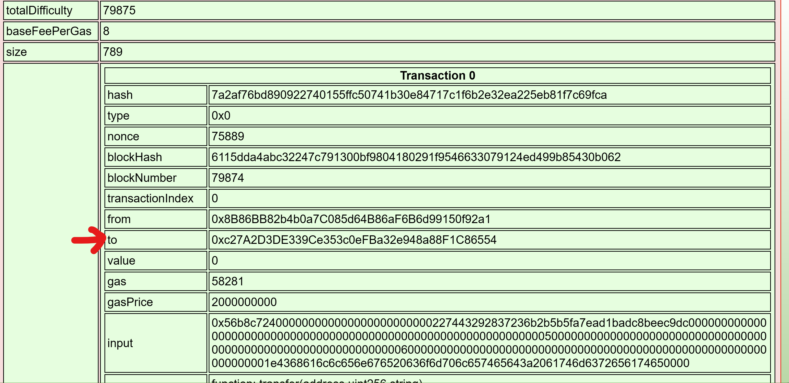

Use the Blockchain Explorer in the Burning Ring of Fire to investigate the contracts and transactions on the chain. At what address is the KringleCoin smart contract deployed? Find hints for this objective hidden throughout the tunnels.

Difficulty: 4/5

## Chat with Slicmer
Don't bug me, kid. Luigi needs me to keep an eye on these offers you can't refute.

The boss told me to watch them for any shifty transactions from wallets that aren't on the pre-sale list.

He said to use this Block Explo... Exploder... thing.

With this, I can see all the movement of the uh... non-fungusable tokens.

Once on the blockchain, it's there forever for the whole world to see.

So if I spot anything that don't look right, I can let Luigi know, and Palzari will get to the bottom of it.

She looks sweet, but she's actually the boss' enforcer. Have you talked to her yet? She even scares me!

It sure would be fun to watch you get on her bad side. Heh heh.

## Terminal
Let's search for a transaction based on a hint for this challenge:
> Find a transaction in the blockchain where someone sent or received KringleCoin! The Solidity Source File is listed as KringleCoin.sol. [Tom's Talk](https://youtu.be/r3zj9DPC8VY) might be helpful!

Now let's grab the To address based on the second hint:
> Look at the transaction information. There is a From: address and a To: address. The To: address lists the address of the KringleCoin smart contract.

## Rejoice
`0xc27A2D3DE339Ce353c0eFBa32e948a88F1C86554` is the required answer.